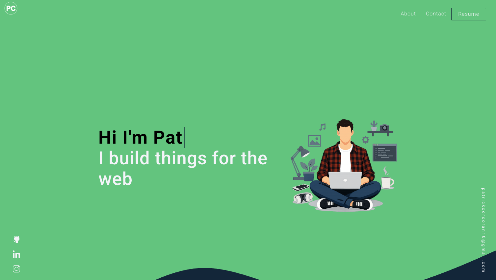

# React Portfolio
 
 

 
 ## Description 
 This is my portfolio that I have created mainly using React and Sass. This portfolio displays information about me, my skills and my projects that I have built and worked on. 

 Link: https://patrickcorcoran10.github.io/portfolio-2026/

 
 ## Table of Contents 

 * [Installation](#installation) 

 * [Usage](#usage) 

 * [License](#license) 

 * [Questions](#questions)

 
 ## Installation 
None

 
 ## Usage 
 Follow the application link here

 
 ## License 
 This application uses a license from MIT 
  
 * Link: https://opensource.org/licenses/MIT

 ## Questions 
 Please find me on GitHub or email me with further questions:

 * GitHub: [patrickcorcoran10](https://github.com/patrickcorcoran10/)

 * Email: patrickcorcoran10@gmail.com